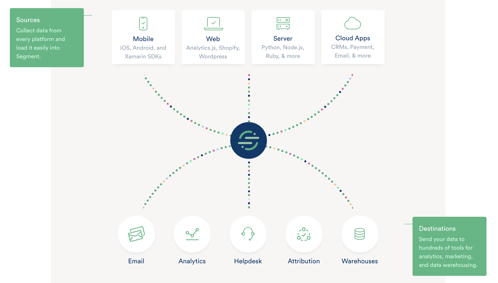
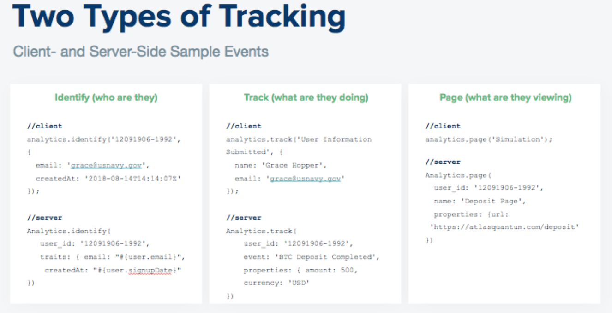

!> ^ IE / SA to find / replace [Customer Name] with actual customer name throughout doc

!>  IE / SA to insert link to customer’s tracking plan on the cover page


# Welcome
To your official & customized guide to Segment! This document is meant to serve as a resource to:
- Facilitate the ongoing ease of Segment implementation
- Ensure consistency across Segment implementations at [Customer Name]
- Summarize key elements of [Customer Name]'s [Tracking Plan](#)
- Highlight special considerations in implementation that [Customer Name] should be aware of for their specific sources and destinations

High-level guidelines:
- Very intentional data is always better than more data
- Prioritize repeatability & extensibility

# Segment 101
[Customer Name] uses Segment to track events that happen when a user interacts with the [Customer Name] interfaces.

Once the data has been captured into Segment, it can be sent (often in real-time) to a wide variety of tools in the analytics, data warehousing, and marketing spaces, typically without having to add new tracking code to production applications.




An overview of Segment’s documentation can be found here:
- [Segment Spec](https://segment.com/docs/spec/)
- [Sources](https://segment.com/docs/sources/)
- [Destinations](https://segment.com/docs/destinations/)


## Sources

> insert some background of different types of sources

### Best Practices
Currently, it is advised to use separated source for each of [Customer Name]’s environments (production, development, stage, etc.) to prevent testing from filling production systems with dummy or broken events.

Segment determines which “source” a call is coming from by means of the API Write Key that it uses as part of the analytics.load() event.

For example, here is the relevant portion of the initialization code for Segment’s JavaScript tracking code is as follows (note: to see non-JavaScript syntaxes, see Segment’s source docs):

```js
analytics.load("[Enter API Write Key here]");
```

!> The appropriate Write Key should always be applied to the correct environment to ensure that all events are tracked to the correct Segment source.

### Core Tracking

Segment has quick start guides that provide the basic code that needs to be included for its events to be available:

*Javascript*
- Quick-Start: https://segment.com/docs/sources/website/analytics.js/quickstart/
- Detailed Documentation: https://segment.com/docs/sources/website/analytics.js/
!> Web library documentation contains specific guidance with examples for implementing the Segment Spec.

*All Others*
For all others (iOS SDK, Android SDK, Clojure, Go, Java, etc.): See detailed documentation here: https://segment.com/docs/sources/


## Tracking Methods
Segment supports two types of tracking:  client-side and server-side. [Customer name] has chosen to implement client-side tracking, thus this document focuses on that method. Here is an overview of the differences:



Segment supports several tracking-related API methods. This document covers the following methods:
- Identify: Who is using your site?
- Page (web); Screen (mobile): What is your customer viewing?
- Track: What is your customer doing?

The following Segment methods are currently out of scope for [Customer Name], but also are other API tracking methods that Segment supports:
- Alias
- Group

###  Identify
The identify() call allows Segment to know who is triggering an event.  Here is a screenshot of your tracking plan that corresponds to Identify: IE / SA to insert link to customer’s tracking plan + screenshot of Identify tab below

[Identify Tab](https://docs.google.com/spreadsheets/d/144fGvHGQ5VbWRbSUEbzRXIu4pweleSRQBiyfbB_RTRE/edit#gid=509136913 ':include :type=iframe width=100% height=400px')


#### When to Call Identify
identify() allows you to understand who is using your applications, as well as which platforms and applications of yours they are using.

identify() should be called in when you can first identify that the user is a known [Customer Name] user (typically during login), or when a user has updated their profile information.

When called as part of the login experience, the identify() call should be made as soon as possible after a user has authenticated.  You only need to call identify() once per session unless the user updates their profile information. When possible, identify() should also be immediately followed by a track event that indicates what caused the user to be identified.

The most important trait to pass as part of the identify() call is userId, which uniquely identifies a user across all [Customer Name] applications. It is recommended that you use some sort of hash value to ensure uniqueness, though other values are acceptable (ie, email address is not preferred, but is usually acceptable due to it being unique and mostly unchanging).

Beyond that, the identify() call is your opportunity to provide information about the user that can be used for future reporting, so you should seek to send any fields that you will want to be able to report on later.  

When making an identify() call as part of a profile update, only the changed information needs to be passed to Segment, although all profile information can be sent if that simplifies implementation.

Gathering of extensive user profile data (e.g., company, city/state, job title, or other user-level data)
Gathering of extensive company-level data (e.g., company size, number of seats, etc)


#### Identify Traits
These are the metadata fields that you’ll pass in each Segment API call to enrich the data that you are sending. These are called “Traits” for identify() method API calls, and “Properties” for all other methods.


## Destinations

> Overview of destinations and modes

### Your Destinations
Your workspace shows the following sources and destinations are enabled currently. In order to access your workspace for the most up-to-date list of sources and destinations, use the following link:  www.segment/com/[customername]  ←  IE / SA to insert link to customer's workspace

!> Insert snapshot of customer's Destinations

### Special considerations

There are a handful of important source-destination pair-specific things that [Customer Name] needs to take into consideration. The major ones are captured in the table below:   IE / SA to fill out this table with nuances they should be aware of for their specific source / destination pairs


#
